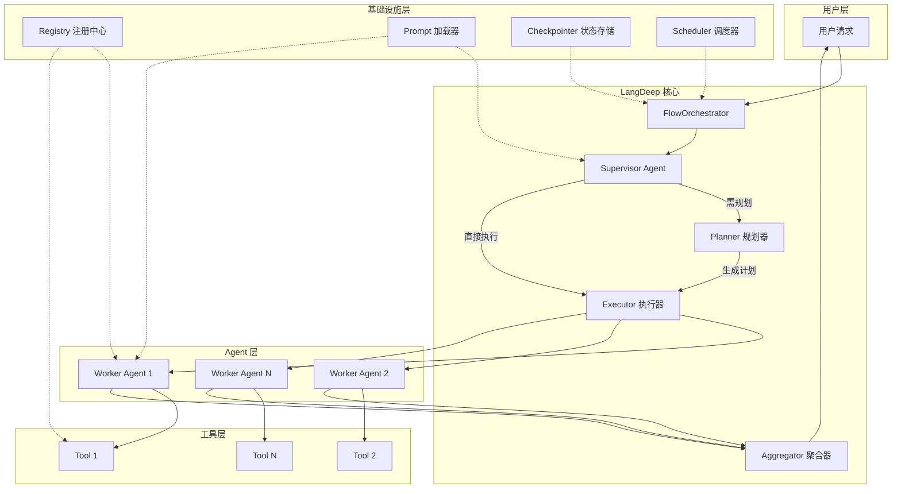

<div align="center">


# LangDeep

**注解驱动的企业级多 Agent 工作流框架**

[](https://www.python.org/downloads/)
[](./LICENSE)
[](https://github.com/langchain-ai/langchain)
[](https://github.com/langchain-ai/langgraph)

⚠️ **项目状态：Alpha**  
API 可能发生变动，欢迎试用并提供反馈，暂不建议直接部署到关键生产环境。

</div>

---

## ✨ 为什么选择 LangDeep？

LangDeep 是一个基于 **LangChain** 和 **LangGraph** 构建的，**注解驱动**、**开箱即用**的企业级多 Agent 工作流框架。它旨在帮助开发者用极少的代码，快速搭建复杂的、具备生产能力的多 Agent 协作系统。

- **🎨 注解驱动**: 使用 `@model`、`@regist_tool`、`@agent` 装饰器声明式注册组件，告别样板代码。
- **🧠 Supervisor（主管）智能调度**: 内置主管 Agent 模式，自动将任务路由给最合适的专家 Agent。
- **📋 内置任务规划器**: LLM 驱动的动态任务拆解，将复杂请求分解为可并行执行的子任务序列。
- **📝 外置 Prompt 管理**: 将 Prompt 存储为 Markdown 文件，支持 `{variable}` 语法插值和热重载。
- **🔌 动态 Provider 注册**: 无需修改核心代码即可接入任何模型提供商（OpenAI、Anthropic、DeepSeek、Ollama...）。
- **⏰ 定时任务与条件调度**: 内置 Cron 调度器，支持定时执行工作流或基于业务条件触发。
- **💾 状态持久化**: 支持 LangGraph Checkpointer，工作流可在任意节点中断并恢复。

---

## 📦 安装

### PyPI 安装（最新发布版）

```bash
pip install langdeep
```

### 从源码安装（最新开发版）

```bash
git clone https://github.com/ZChunzi/langdeep.git
cd langdeep/LangDeep
pip install -e .
```

### 部分依赖安装

```bash
# 仅安装核心依赖（最简）
pip install -e .

# 安装所有可选 Provider
pip install -e ".[all]"

# 安装状态持久化支持
pip install -e ".[persist]"
```

---

## 🚀 快速开始 (5 分钟完整示例)

以下是一个端到端的示例：注册一个天气查询工具，定义一个天气专家 Agent，然后通过协调器执行任务。

```python
from langdeep import FlowOrchestrator, agent, regist_tool

# 1. 注册工具
@regist_tool(name="get_weather", description="获取指定城市的天气")
def get_weather(city: str) -> str:
    # 模拟天气查询
    return f"{city} 晴朗，25°C"

# 2. 注册 Agent
@agent(
    name="weather_expert",
    description="天气专家，能够查询各地天气",
    tools=["get_weather"]
)
def weather_expert():
    pass  # 装饰器已自动注册，函数体可为空

# 3. 初始化协调器（自动扫描所有 @agent/@regist_tool/@model 装饰的组件）
orchestrator = FlowOrchestrator(supervisor_model="gpt-4o")

# 4. 运行
result = orchestrator.run("北京今天天气怎么样？")
print(result)
```

---

## 🧠 核心概念

### 注解驱动 (`@agent`, `@regist_tool`, `@model`)

LangDeep 通过 Python 装饰器将组件自动注册到全局注册中心。**装饰器参数即为注册信息**，无需在函数内返回配置字典。

> **命名说明**：`@regist_tool` 使用 `regist_` 前缀是为了避免与用户代码中常见的 `tool` 变量/函数名冲突。

```python
@agent(
    name="research_agent",
    description="专业研究助手，能联网搜索学术资料",
    model="claude-3-opus",
    tools=["web_search"]
)
def research_agent():
    # 函数体用于构建 Agent 的具体逻辑（如返回 LangGraph 图），
    # 若无需额外初始化，留空即可。
    pass
```

### Supervisor（主管）协调机制

`FlowOrchestrator` 在运行时动态构建 LangGraph 图，核心是一个 Supervisor Agent。它负责分析用户请求，决定是否需要先规划（Planner），然后按计划调度具体的 Worker Agent 执行，最后聚合结果。

### 外置 Prompt 管理

将 Prompt 模板以 Markdown 格式存储在 `prompts/` 目录中，支持 `{variable_name}` 语法进行变量插值。框架内置了 `supervisor`、`planner`、`aggregator` 等核心 Prompt，您也可以覆盖或新增。

**目录结构示例：**
```
prompts/
├── supervisor.md          # 主管 Prompt
├── planner.md             # 规划器 Prompt
├── aggregator.md          # 聚合器 Prompt
├── research_agent.md      # 自定义 Agent Prompt
└── writer_agent.md
```

**prompts/supervisor.md 内容片段：**
```markdown
# 系统角色
你是一个智能任务调度主管。

## 可调度专家列表
{available_agents}

## 用户请求
{user_input}
```

**引用自定义 Prompt：**
```python
@agent(
    name="custom_agent",
    prompt_path="prompts/research_agent.md"   # 指定外置 Prompt 路径
)
def custom_agent():
    pass
```

### 交互式测试入口

框架提供了交互式 Agent 调用脚本，自动路由到已注册的 Agent 处理问题：

```bash
python agent_test.py
```

它使用 `FlowOrchestrator` 自动扫描 `models/`、`tools/`、`agents/` 目录下的所有组件，并流式输出结果。

---

### 动态 Provider 注册

您可以轻松接入新的模型提供商。例如，注册一个 DeepSeek Provider：

```python
from langdeep import register_provider

register_provider(
    name="deepseek",
    base_url="https://api.deepseek.com/v1",
    api_key_env="DEEPSEEK_API_KEY"   # 从环境变量读取密钥
)
```

之后即可在 `@model` 装饰器中使用该 Provider：
```python
@model(name="deepseek-chat", provider="deepseek", model_name="deepseek-chat")
def my_deepseek():
    pass
```

---

## 🏗️ 架构图

> **说明**：下图展示了 LangDeep 框架内部的运行时结构。您只需定义 Agent 和 Tool，`FlowOrchestrator` 会自动处理 Supervisor 决策、Planner 规划、Executor 调度和 Aggregator 聚合。



---

## 📁 项目结构

```
langdeep/                        # 项目根目录
├── LangDeep/                    # Python 包源码
│   ├── src/                     # 框架核心代码 (映射为 langdeep 包)
│   │   ├── core/
│   │   │   ├── decorators/      # 注解装饰器 (@model, @regist_tool, @agent)
│   │   │   ├── registry/        # 模型/工具/Agent 注册中心
│   │   │   ├── orchestrator/    # 流程协调器 (Supervisor 模式)
│   │   │   ├── planner/         # 任务规划器
│   │   │   ├── prompt/          # Markdown Prompt 加载器
│   │   │   └── scheduling/      # 定时任务调度器
│   │   ├── schemas/             # 数据模型 & 状态定义
│   │   ├── utils/               # 工具函数
│   │   └── resources/           # 内置 Prompt 模板
│   └── pyproject.toml           # 项目配置与依赖
├── agents/                      # 业务 Agent 定义
├── models/                      # 模型 Provider 注册
├── tools/                       # 工具函数定义
├── examples/                    # 完整使用示例
├── workflows/                   # 预定义工作流 (YAML/JSON)
├── tests/                       # 单元测试
├── main.py                      # 简易入口示例
└── agent_test.py                # 交互式 Agent 测试入口
```

---

## 🔗 与 LangGraph 的关系

LangDeep 是 LangGraph 的上层封装与代码生成器。

- **运行时动态构图**：`FlowOrchestrator` 会根据已注册的 Agent 和工具，在运行时自动构建 `StateGraph`，添加 Supervisor、Planner、Executor 以及各 Worker Agent 节点。
- **状态管理**：框架内部使用 LangGraph 的 `State` 和 `Checkpointer`，您无需手动定义状态结构。
- **获取底层图对象**：如果您需要深度定制，可以通过 `orchestrator.graph` 获取编译后的 `StateGraph` 对象进行修改。

```python
orchestrator = FlowOrchestrator()
graph = orchestrator.graph  # 获取底层 StateGraph

# 添加自定义节点
def custom_node(state):
    return {"messages": ["自定义处理"]}

graph.add_node("custom", custom_node)
```

---

## 📖 进阶配置

### 定时任务

使用 `@cron` 装饰器定义周期性任务（基于 `scheduling` 模块）：

```python
from langdeep.scheduling import cron

# 假设 orchestrator 已在全局作用域定义
orchestrator = FlowOrchestrator(supervisor_model="gpt-4o")

@cron("0 9 * * *")  # 每天上午9点执行
def daily_report():
    orchestrator.run("生成今日科技新闻简报")
```

### 启用状态持久化

```python
orchestrator = FlowOrchestrator(
    supervisor_model="gpt-4o",
    enable_checkpoint=True   # 开启 MemorySaver
)
```

### 流式输出

```python
async for chunk in orchestrator.astream("你的问题"):
    print(chunk)
```

### 自定义 Prompt 目录

```python
orchestrator = FlowOrchestrator(
    supervisor_model="deepseek-chat",
    prompt_dir="./my_prompts"   # 覆盖内置 Prompt
)
```

---

## 🤝 贡献

我们欢迎所有形式的贡献！请参阅 [CONTRIBUTING.md](./CONTRIBUTING.md) 了解详情。

---

## 📄 许可证

MIT © 2025 LangDeep 贡献者