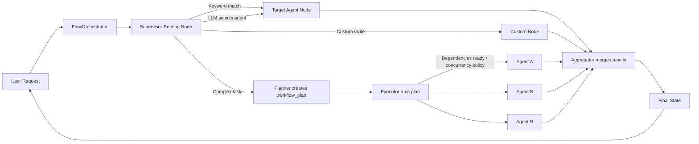
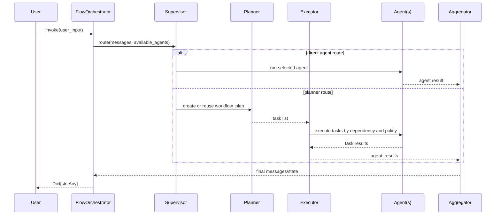

<div align="center">


# LangDeep

**An annotation-driven multi-agent workflow framework designed for enterprise scenarios**

[](https://www.python.org/downloads/)
[](./LICENSE)
[](https://github.com/langchain-ai/langchain)
[](https://github.com/langchain-ai/langgraph)

**Language:** English | [简体中文](README.zh-CN.md)

**Project Status: Beta - v2.0.12**

The core API has entered its second major version and is suitable for controlled internal enterprise pilots. Critical production deployments should still complete provider, secret, audit, sandbox, persistence, and operations reviews before release.

</div>

---

## ✨ Why LangDeep?

LangDeep is built on **LangChain** and **LangGraph**. It provides a registry-based and decorator-first framework for multi-agent workflows. You can register components through declarative APIs such as `@model`, `@register_tool`, and `@agent`, then let `FlowOrchestrator` coordinate Supervisor routing, Planner generation, Executor execution, and Aggregator merging.

The focus of v2.0.0 is robustness: runtime diagnostics, stronger health checks, public model configuration snapshots, and stricter test and coverage gates. These capabilities make LangDeep easier to validate before service startup and safer to operate in CI pipelines.

- **🎨 Annotation-driven registration**: register components with `@model`, `@provider`, `@register_tool`, `@agent`, `@memory`, `@cache`, `@im_channel`, and `@sandbox`.
- **🧠 Supervisor routing**: use keyword routing first, then LLM tool-call routing for more complex requests.
- **📋 Planning and execution**: support LLM-generated plans, explicit `workflow_plan`, dependency ordering, concurrent execution, and retries.
- **🔌 Provider extensibility**: built-in OpenAI, Anthropic, Azure OpenAI, Ollama, Vertex AI, Google GenAI, DeepSeek, and mock providers, with custom provider support.
- **🧩 Enterprise extension points**: replace `RoutingStrategy`, `PlanGenerator`, `TaskRunner`, and `ResultMerger`.
- **🗄️ Storage and cache abstractions**: register pluggable backends with `@memory` and `@cache`; LLM response cache is disabled by default and must be enabled explicitly.
- **💬 IM integration layer**: provide `@im_channel`, `WebhookReceiver`, `IMMessage`, and `PlatformType` for messaging platform adapters.
- **🔒 Sandbox execution**: built-in `SubprocessSandbox` and `@sandbox`; suitable for trusted or semi-trusted local tasks, not a complete boundary for untrusted code.
- **🔐 Secret management**: use `SecretsManager` and `EnvSecretsProvider` to avoid hard-coded secrets in application code.
- **🔄 Process lifecycle**: use `ProcessManager` and `ProcessState` as infrastructure for long-running workflows.
- **📊 Observability**: `HealthChecker`, `MetricsCollector`, and `FlowOrchestrator.health()` expose runtime status and basic metrics.
- **✅ Startup diagnostics**: `validate_runtime()` checks models, providers, agent/tool references, and optional agent instantiation to catch configuration drift early.

---

## 📦 Installation

### Install from PyPI

```bash
pip install langdeep
```

### Install from source

```bash
git clone https://github.com/ZChunzi/LangDeep.git
cd LangDeep
pip install -e .
```

### Optional dependencies

```bash
# Optional model provider dependencies
pip install -e ".[all]"

# Individual provider dependency groups are also available:
# .[anthropic], .[google-genai], .[vertexai], .[ollama]

# Test, coverage, lint, and build tooling
pip install -e ".[dev]"
```

---

## 🚀 Quick Start: No External API Key Required

The example below uses the built-in `mock` provider and can run locally without external credentials. Note: functions wrapped by `@register_tool` or `@regist_tool` must have a docstring because LangChain validates tool descriptions when creating tools.

```python
from langdeep import (
    AssistantMessage,
    FlowOrchestrator,
    UserMessage,
    agent,
    last_assistant_text,
    model,
    register_tool,
    validate_runtime,
)


@model(name="mock_chat", provider="mock", model_name="mock-chat")
def mock_chat():
    pass


@register_tool(name="get_weather", description="Return mock weather.")
def get_weather(city: str) -> str:
    """Return mock weather."""
    return f"{city}: sunny, 25C"


@agent(
    name="weather_agent",
    description="Answer simple weather questions.",
    routing_keywords=["weather", "天气"],
    model="mock_chat",
    tools=["get_weather"],
)
def weather_agent():
    class WeatherAgent:
        def invoke(self, state):
            question = ""
            for message in reversed(state.get("messages", [])):
                if isinstance(message, UserMessage):
                    question = str(message.content)
                    break
            answer = f"Question: {question}\n{get_weather('Beijing')}"
            return {"messages": [AssistantMessage(content=answer)]}

        async def ainvoke(self, state):
            return self.invoke(state)

    return WeatherAgent()


# Recommended before enterprise service startup
validate_runtime(instantiate_agents=True).raise_for_errors()

orchestrator = FlowOrchestrator(
    supervisor_model="mock_chat",
    enable_checkpoint=False,
)

result = orchestrator.invoke("How is the weather in Beijing?")
print(last_assistant_text(result))
```

---

## 🧠 Core Concepts

### Registries and decorators

LangDeep runtime is centered around a set of in-process singleton registries. Decorators write metadata into registries at module import time. `FlowOrchestrator` reads the current registry state during initialization and builds the LangGraph workflow from it.

| Decorator / API | Registered content | Primary purpose |
|---|---|---|
| `@model` | `ModelConfig` | Register model configuration; model instances are lazy-loaded |
| `@provider` / `register_provider` | Provider factory | Add or override model providers |
| `@register_tool` | LangChain Tool | Register tools available to agents |
| `@agent` | Agent factory and metadata | Register routable and executable agents |
| `@memory` | Memory backend factory | Register session memory backends |
| `@cache` | Cache backend factory | Register cache backends |
| `@im_channel` | IM handler | Register messaging platform handlers |
| `@sandbox` | Sandbox backend | Register code execution backends |

### FlowOrchestrator

`FlowOrchestrator` is the main entry point. The public methods in the current version are:

- `invoke(user_input, context=None, workflow_plan=None, template_name=None)`
- `ainvoke(user_input, context=None, workflow_plan=None, template_name=None)`
- `astream(user_input, context=None, **kwargs)`
- `chat(user_input, session_id=None, context=None, ...)`
- `chat_text(user_input, session_id=None, context=None, ...)`
- `invoke_messages(messages, context=None, ...)`
- `invoke_state(state, context=None)`
- `health()`
- `get_metrics()`
- `graph`

`invoke()` accepts plain strings, a single LangChain message, a sequence of
LangChain messages, or a LangGraph-style state dict such as
`{"messages": [user_message("hi")]}`. Use `chat(..., session_id=...)`
for multi-turn conversations backed by a registered memory backend.

There is no public `run()` method. Use `invoke()` or `chat()` instead.

### Agent runtime contract

The factory registered by `@agent` should return a runnable object with at least:

```python
def invoke(self, state): ...
```

For async execution compatibility, it is recommended to also provide:

```python
async def ainvoke(self, state): ...
```

If `auto_build=True` is set and the factory returns `None`, LangDeep will try to build the agent through the registered Agent Builder.

---

## 🏗️ Architecture

### Runtime flow


```mermaid
flowchart LR
    User["User Request"] --> Orchestrator["FlowOrchestrator"]
    Orchestrator --> Supervisor["Supervisor Routing Node"]

    Supervisor -->|"Keyword match"| AgentNode["Target Agent Node"]
    Supervisor -->|"LLM selects agent"| AgentNode
    Supervisor -->|"Complex task"| Planner["Planner creates workflow_plan"]
    Supervisor -->|"Custom route"| CustomNode["Custom Node"]

    Planner --> Executor["Executor runs plan"]
    Executor -->|"Dependencies ready / concurrency policy"| AgentA["Agent A"]
    Executor --> AgentB["Agent B"]
    Executor --> AgentN["Agent N"]

    AgentNode --> Aggregator["Aggregator merges results"]
    CustomNode --> Aggregator
    AgentA --> Aggregator
    AgentB --> Aggregator
    AgentN --> Aggregator

    Aggregator --> FinalState["Final State"]
    FinalState --> User
```

### Registries and infrastructure


```mermaid
flowchart TB
    subgraph App["Application Code"]
        Models["@model"]
        Providers["@provider / register_provider"]
        Tools["@register_tool"]
        Agents["@agent"]
        Memory["@memory"]
        Cache["@cache"]
        IM["@im_channel"]
        Sandbox["@sandbox"]
    end

    subgraph Registries["LangDeep Registries"]
        ModelRegistry["model_registry"]
        ProviderRegistry["provider_registry"]
        ToolRegistry["tool_registry"]
        AgentRegistry["agent_registry"]
        MemoryRegistry["memory_registry"]
        CacheRegistry["cache_registry"]
        IMRegistry["im_channel_registry"]
        SandboxRegistry["sandbox_registry"]
    end

    subgraph Runtime["Runtime Core"]
        Orchestrator["FlowOrchestrator"]
        PromptLoader["MarkdownPromptLoader"]
        ExecutionPolicy["ExecutionPolicy"]
        Diagnostics["validate_runtime"]
        Health["HealthChecker"]
        Metrics["MetricsCollector"]
        Secrets["SecretsManager"]
        Process["ProcessManager"]
    end

    Models --> ModelRegistry
    Providers --> ProviderRegistry
    Tools --> ToolRegistry
    Agents --> AgentRegistry
    Memory --> MemoryRegistry
    Cache --> CacheRegistry
    IM --> IMRegistry
    Sandbox --> SandboxRegistry

    ModelRegistry --> Orchestrator
    ProviderRegistry --> Orchestrator
    ToolRegistry --> Orchestrator
    AgentRegistry --> Orchestrator
    PromptLoader --> Orchestrator
    ExecutionPolicy --> Orchestrator

    ModelRegistry --> Diagnostics
    ToolRegistry --> Diagnostics
    AgentRegistry --> Diagnostics

    ModelRegistry --> Health
    MemoryRegistry --> Health
    CacheRegistry --> Health
    ToolRegistry --> Health
    AgentRegistry --> Health

    Secrets -.-> Orchestrator
    Process -.-> Orchestrator
    Metrics -.-> Orchestrator
```

### Planning and execution sequence


```mermaid
sequenceDiagram
    participant U as User
    participant O as FlowOrchestrator
    participant S as Supervisor
    participant P as Planner
    participant E as Executor
    participant A as Agent(s)
    participant G as Aggregator

    U->>O: invoke(user_input)
    O->>S: route(messages, available_agents)
    alt direct agent route
        S->>A: run selected agent
        A-->>G: agent result
    else planner route
        S->>P: create or reuse workflow_plan
        P-->>E: task list
        E->>A: execute tasks by dependency and policy
        A-->>E: task results
        E-->>G: agent_results
    end
    G-->>O: final messages/state
    O-->>U: Dict[str, Any]
```

---

## 🔌 Models and Providers

### Use a built-in provider

```python
import os
from langdeep import model


@model(
    name="gpt4o",
    provider="openai",
    model_name="gpt-4o",
    api_key=os.getenv("OPENAI_API_KEY"),
    temperature=0.2,
)
def gpt4o():
    pass
```

Built-in provider names:

- `openai`
- `anthropic`
- `azure_openai`
- `ollama`
- `vertexai`
- `google_genai`
- `deepseek`
- `mock`

### DeepSeek v4 thinking mode

The built-in `deepseek` provider uses `DeepSeekChatModel`, a LangChain
`ChatOpenAI` adapter that preserves DeepSeek `reasoning_content` for v4 tool
calls and removes it for `deepseek-reasoner` history.

```python
import os
from langdeep import configure_deepseek_v4, model


@model(
    name="deepseek_v4",
    provider="deepseek",
    model_name="deepseek-v4-pro",
    api_key=os.getenv("DEEPSEEK_API_KEY"),
    extra_params=configure_deepseek_v4(
        thinking="enabled",
        reasoning_effort="high",
    ),
)
def deepseek_v4():
    pass
```

`@model` accepts provider-specific settings either through `extra_params={...}`
or directly as keyword arguments. For DeepSeek compatibility, top-level
`thinking={...}` is also accepted and normalized into DeepSeek's required
`extra_body={"thinking": ...}` request shape.

For advanced providers, reuse `build_deepseek_payload_messages()` or set
`reasoning_content_policy` to `auto`, `preserve`, `tool_calls`, or `drop`.

### Register a custom provider

A provider factory receives `ModelConfig` and returns a LangChain `BaseChatModel`.

```python
from langchain_core.language_models import BaseChatModel
from langdeep import ModelConfig, provider, register_provider


@provider(name="custom_provider")
def create_custom_provider(config: ModelConfig) -> BaseChatModel:
    ...


def create_other_provider(config: ModelConfig) -> BaseChatModel:
    ...


register_provider("other_provider", create_other_provider)
```

> Note: the current signature of `register_provider()` is `register_provider(name, factory)`. It is not a configuration-style function. Provider settings such as `base_url` and `api_key` should be passed through `@model(..., base_url=..., api_key=...)` or `ModelConfig`.

---

## 🧩 Agents, Tools, and Auto-Building

### Register a tool

```python
from langdeep import register_tool


@register_tool(
    name="search_docs",
    description="Search internal documentation.",
    category="knowledge",
    tags=["internal", "docs"],
)
def search_docs(query: str) -> str:
    """Search internal documentation."""
    return f"results for {query}"
```

`regist_tool` remains available as a backward-compatible alias.

### Register an agent

```python
from langdeep import AssistantMessage, agent


@agent(
    name="support_agent",
    description="Handle customer support questions.",
    capabilities=["support"],
    routing_keywords=["support", "help", "支持"],
    model="gpt4o",
    tools=["search_docs"],
)
def support_agent():
    class SupportAgent:
        def invoke(self, state):
            return {"messages": [AssistantMessage(content="Support response")]}

        async def ainvoke(self, state):
            return self.invoke(state)

    return SupportAgent()
```

### ReAct auto-building

```python
@agent(
    name="react_support",
    description="Auto-built ReAct support agent.",
    model="gpt4o",
    tools=["search_docs"],
    auto_build=True,
    agent_type="react",
)
def react_support():
    pass
```

---

## 📋 Workflow Plans and Execution Policy

### Explicit workflow_plan

```python
plan = [
    {"id": "collect", "agent": "research_agent", "depends_on": [], "status": "pending"},
    {"id": "write", "agent": "writer_agent", "depends_on": ["collect"], "status": "pending"},
]

result = orchestrator.invoke("Create a market briefing", workflow_plan=plan)
```

### Plan validation

```python
from langdeep import validate_workflow_plan


validate_workflow_plan(
    plan,
    available_agents=["research_agent", "writer_agent"],
    available_tools=[],
)
```

### Execution policy

```python
from langdeep import ExecutionPolicy


policy = ExecutionPolicy(
    strategy="priority_queue",
    max_concurrency=3,
    max_retries=3,
    retry_backoff="exponential",
    timeout_seconds=30,
    fail_fast=False,
)
```

Supported strategies:

- `gather`: run ready tasks concurrently, limited by `max_concurrency`.
- `sequential`: run tasks sequentially according to dependencies.
- `priority_queue`: run higher-priority tasks first.

---

## ✅ Enterprise Diagnostics and Health Checks

### Startup diagnostics

```python
from langdeep import validate_runtime


diagnostics = validate_runtime(instantiate_agents=True)
diagnostics.raise_for_errors()
```

`validate_runtime()` checks:

- Whether model registry names, model names, and providers are valid.
- Whether `temperature` and `max_tokens` are reasonable.
- Whether agent metadata names match registry keys.
- Whether models and tools referenced by agents are registered.
- Whether agents can be instantiated when `instantiate_agents=True`.
- Whether tool metadata is consistent and descriptions are present.

The result is serializable:

```python
{
    "ok": True,
    "error_count": 0,
    "warning_count": 0,
    "issues": [],
}
```

### Health checks and metrics

```python
health = orchestrator.health()
metrics = orchestrator.get_metrics()
```

`HealthChecker` probes model, memory, and cache backends, and reports Agent/Tool registry consistency. `MetricsCollector` provides counters, gauges, histograms, and snapshot reads.

---

## 🗄️ Memory, Cache, and Prompt

### Memory

```python
from langdeep import memory


@memory(name="session_memory", description="In-process session memory")
def session_memory():
    pass
```

If the factory returns `None`, the built-in `InMemoryBackend` is used.

### Cache

```python
from langdeep import cache


@cache(name="llm_cache", ttl=300, max_entries=1024)
def llm_cache():
    pass
```

If the factory returns `None`, the built-in `MemoryCache` is used. LLM response cache is disabled by default and must be enabled explicitly:

```python
from langdeep.core.registry.model_registry import model_registry


model_registry.enable_response_cache(ttl=300, max_entries=1024)
```

### Prompt

`MarkdownPromptLoader` supports built-in prompts and external `prompt_dir` overrides. Prompts are cached, and the cache can be cleared through the loader's `reload()` method.

```python
orchestrator = FlowOrchestrator(
    supervisor_model="gpt4o",
    prompt_dir="./prompts",
)
```

---

## 🔒 Security and Production Boundaries

LangDeep provides enterprise-oriented infrastructure, but it does not replace production governance.

- `SubprocessSandbox` is not a complete security boundary for untrusted code. Production systems should use container, permission, network, and resource isolation.
- API keys should be injected through `SecretsManager`, environment variables, or platform secret systems. Do not hard-code them in source code.
- When integrating IM platforms, verify signatures, retry policies, permission boundaries, and audit requirements in the application layer.
- When accepting external `workflow_plan` input, run `validate_workflow_plan()` first.
- At service startup, run `validate_runtime(instantiate_agents=True).raise_for_errors()`.
- For critical paths, record user request, routing target, workflow plan, tool usage, failure reason, and trace id.

---

## 🧪 Tests and Quality Gates

```bash
# Static checks
python -m ruff check src tests

# Standard pytest with coverage
python -m pytest --cov --cov-report=term-missing --cov-report=xml

# Project custom test runner
python tests/run_all.py

# Compile check
python -m compileall -q src tests

# Build package
python -m build --no-isolation
```

The current coverage threshold is configured as `90%` in `pyproject.toml`.

---

## 📚 More Documentation

Full developer guide:

- [docs/developer-guide.md](docs/developer-guide.md)

Other languages:

- [简体中文](README.zh-CN.md)

---

## 📌 v2.0.1 Release Notes

v2.0.1 is a maintenance release focused on new tool policy infrastructure and improved packaging.

- Added `PolicyAwareTool`, `ToolAuditLog`, `ToolExecutionPolicy`, and `ToolExecutionRecord` for fine-grained tool governance.
- Added packaging tests (`test_packaging.py`) to verify build and import integrity.
- Updated documentation with tool policy usage guides and packaging verification steps.
- Updated project status to Beta - v2.0.1.

---

## 📌 v2.0.0 Release Notes

v2.0.0 highlights:

- Added `validate_runtime()`, `RuntimeValidator`, and `RuntimeDiagnostics`.
- Enhanced `HealthChecker` with memory/cache backend probes and Agent/Tool registry consistency reports.
- Added public model configuration snapshot APIs: `ModelRegistry.get_config()` and `ModelRegistry.list_model_configs()`.
- Updated package version to `2.0.0` and project status to Beta.
- Added diagnostics tests while keeping the standard pytest suite and custom test runner passing.

---

## 📄 License

LangDeep is released under the MIT License.
