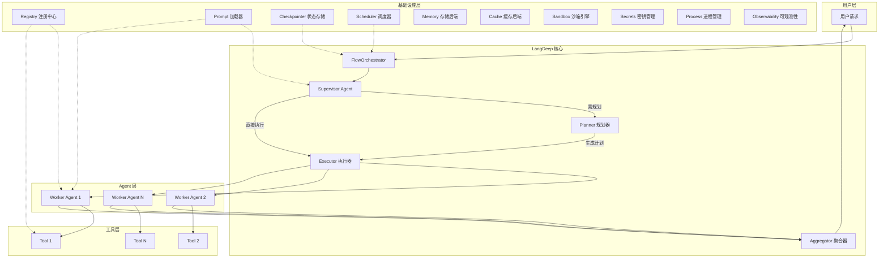

<div align="center">


# LangDeep

**注解驱动、面向企业场景设计的多 Agent 工作流框架**

[](https://www.python.org/downloads/)
[](./LICENSE)
[](https://github.com/langchain-ai/langchain)
[](https://github.com/langchain-ai/langgraph)

**项目状态：Beta — v2.0.0**
核心 API 已进入第二个大版本，适合在企业内部场景做受控试点；关键生产环境仍应先完成模型、密钥、审计、沙箱和运维策略评审。

</div>

---

## ✨ 为什么选择 LangDeep？

LangDeep 是一个基于 **LangChain** 和 **LangGraph** 构建的，**注解驱动**、**开箱即用**、面向企业场景设计的多 Agent 工作流框架。它旨在帮助开发者用极少的代码，快速搭建复杂的多 Agent 协作系统。v2.0 增强了启动前诊断、健康检查和注册表一致性能力，生产部署前仍需要结合自身场景补齐安全、运维和可靠性配置。

- **🎨 注解驱动**: 使用 `@model`、`@regist_tool`、`@agent`、`@memory`、`@cache`、`@im_channel` 装饰器声明式注册组件，告别样板代码。
- **🧠 Supervisor（主管）智能调度**: 内置主管 Agent 模式，自动将任务路由给最合适的专家 Agent。
- **📋 内置任务规划器**: LLM 驱动的动态任务拆解，将复杂请求分解为可并行执行的子任务序列。
- **📝 外置 Prompt 管理**: 将 Prompt 存储为 Markdown 文件，支持 `{variable}` 语法插值和热重载。
- **🔌 动态 Provider 注册**: 无需修改核心代码即可接入任何模型提供商（OpenAI、Anthropic、DeepSeek、Ollama...）。
- **⏰ 定时任务与条件调度**: 内置 Cron 调度器，支持定时执行工作流或基于业务条件触发。
- **💾 状态持久化**: 支持 LangGraph Checkpointer，工作流可在任意节点中断并恢复。
- **🗄️ 可插拔存储后端**: `@memory` 注解注册记忆存储（Redis / SQLite / 内存），`@cache` 注解注册 LLM 响应缓存，统一的抽象接口层。
- **💬 即时通讯接入**: `@im_channel` 注解注册消息处理器，内置 Webhook 接收器，支持企业微信、钉钉、飞书、Slack 等平台。
- **🔒 沙箱执行**: `@sandbox` 注解注册代码执行后端；内置 `SubprocessSandbox` 适合可信/半可信本地任务，不应作为不可信代码的安全边界。
- **🔐 密钥管理**: 内置 `SecretsManager`，支持多环境变量源的分层密钥解析，避免硬编码敏感信息。
- **🔄 进程管理**: `ProcessManager` 管理长时间运行的工作流生命周期，支持暂停（Suspend）/恢复（Resume）和信号机制。
- **📊 可观测性**: 内置 `HealthChecker` 健康检查和 `MetricsCollector` 指标收集，支持运行时健康诊断。`FlowOrchestrator.health()` 一键检测。
- **✅ 运行时诊断**: `validate_runtime()` 在服务启动前检查模型 Provider、Agent 模型引用、工具依赖和可选 Agent 实例化，提前暴露配置风险。

---

## 📦 安装

### PyPI 安装（最新发布版）

```bash
pip install langdeep
```

### 从源码安装（最新开发版）

```bash
git clone https://github.com/ZChunzi/langdeep.git
cd langdeep/LangDeep
pip install -e .
```

### 部分依赖安装

```bash
# 仅安装核心依赖（最简）
pip install -e .

# 安装所有可选 Provider
pip install -e ".[all]"

# 安装状态持久化支持
pip install -e ".[persist]"
```

---

## 🚀 快速开始 (5 分钟完整示例)

以下是一个端到端的示例：注册一个天气查询工具，定义一个天气专家 Agent，然后通过协调器执行任务。

```python
from langdeep import FlowOrchestrator, agent, regist_tool

# 1. 注册工具
@regist_tool(name="get_weather", description="获取指定城市的天气")
def get_weather(city: str) -> str:
    # 模拟天气查询
    return f"{city} 晴朗，25°C"

# 2. 注册 Agent
@agent(
    name="weather_expert",
    description="天气专家，能够查询各地天气",
    tools=["get_weather"]
)
def weather_expert():
    pass  # 装饰器已自动注册，函数体可为空

# 3. 初始化协调器（自动扫描所有 @agent/@regist_tool/@model 装饰的组件）
orchestrator = FlowOrchestrator(supervisor_model="gpt-4o")

# 4. 运行
result = orchestrator.run("北京今天天气怎么样？")
print(result)
```

---

## 🧠 核心概念

### 注解驱动 (`@agent`, `@regist_tool`, `@model`)

LangDeep 通过 Python 装饰器将组件自动注册到全局注册中心。**装饰器参数即为注册信息**，无需在函数内返回配置字典。

> **命名说明**：`@regist_tool` 使用 `regist_` 前缀是为了避免与用户代码中常见的 `tool` 变量/函数名冲突。

```python
@agent(
    name="research_agent",
    description="专业研究助手，能联网搜索学术资料",
    model="claude-3-opus",
    tools=["web_search"]
)
def research_agent():
    # 函数体用于构建 Agent 的具体逻辑（如返回 LangGraph 图），
    # 若无需额外初始化，留空即可。
    pass
```

### Supervisor（主管）协调机制

`FlowOrchestrator` 在运行时动态构建 LangGraph 图，核心是一个 Supervisor Agent。它负责分析用户请求，决定是否需要先规划（Planner），然后按计划调度具体的 Worker Agent 执行，最后聚合结果。

### 外置 Prompt 管理

将 Prompt 模板以 Markdown 格式存储在 `prompts/` 目录中，支持 `{variable_name}` 语法进行变量插值。框架内置了 `supervisor`、`planner`、`aggregator` 等核心 Prompt，您也可以覆盖或新增。

**目录结构示例：**
```
prompts/
├── supervisor.md          # 主管 Prompt
├── planner.md             # 规划器 Prompt
├── aggregator.md          # 聚合器 Prompt
├── research_agent.md      # 自定义 Agent Prompt
└── writer_agent.md
```

**prompts/supervisor.md 内容片段：**
```markdown
# 系统角色
你是一个智能任务调度主管。

## 可调度专家列表
{available_agents}

## 用户请求
{user_input}
```

**引用自定义 Prompt：**
```python
@agent(
    name="custom_agent",
    prompt_path="prompts/research_agent.md"   # 指定外置 Prompt 路径
)
def custom_agent():
    pass
```

### 交互式测试入口

框架提供了交互式 Agent 调用脚本，自动路由到已注册的 Agent 处理问题：

```bash
python agent_test.py
```

它使用 `FlowOrchestrator` 自动扫描 `models/`、`tools/`、`agents/` 目录下的所有组件，并流式输出结果。

---

### 动态 Provider 注册

您可以轻松接入新的模型提供商。例如，注册一个 DeepSeek Provider：

```python
from langdeep import register_provider

register_provider(
    name="deepseek",
    base_url="https://api.deepseek.com/v1",
    api_key_env="DEEPSEEK_API_KEY"   # 从环境变量读取密钥
)
```

之后即可在 `@model` 装饰器中使用该 Provider：
```python
@model(name="deepseek-chat", provider="deepseek", model_name="deepseek-chat")
def my_deepseek():
    pass
```

---

## 🏗️ 架构图

> **说明**：下图展示了 LangDeep 框架内部的运行时结构。您只需定义 Agent 和 Tool，`FlowOrchestrator` 会自动处理 Supervisor 决策、Planner 规划、Executor 调度和 Aggregator 聚合。


```mermaid
graph TB
    subgraph UserLayer["用户层"]
        User[用户请求]
    end

    subgraph LangDeepCore["LangDeep 核心"]
        Orchestrator[FlowOrchestrator]
        Supervisor[Supervisor Agent]
        Planner[Planner 规划器]
        Executor[Executor 执行器]
        Aggregator[Aggregator 聚合器]
    end

    subgraph AgentLayer["Agent 层"]
        Agent1[Worker Agent 1]
        Agent2[Worker Agent 2]
        AgentN[Worker Agent N]
    end

    subgraph ToolLayer["工具层"]
        Tool1[Tool 1]
        Tool2[Tool 2]
        ToolN[Tool N]
    end

    subgraph InfraLayer["基础设施层"]
        Registry[Registry 注册中心]
        PromptLoader[Prompt 加载器]
        Checkpointer[Checkpointer 状态存储]
        Scheduler[Scheduler 调度器]
        MemoryBackend[Memory 存储后端]
        CacheBackend[Cache 缓存后端]
        SandboxEngine[Sandbox 沙箱引擎]
        SecretsManager[Secrets 密钥管理]
        ProcessManager[Process 进程管理]
        Observability[Observability 可观测性]
    end

    User --> Orchestrator
    Orchestrator --> Supervisor
    Supervisor -->|需规划| Planner
    Supervisor -->|直接执行| Executor
    Planner -->|生成计划| Executor
    Executor --> Agent1
    Executor --> Agent2
    Executor --> AgentN
    Agent1 --> Tool1
    Agent2 --> Tool2
    AgentN --> ToolN
    Agent1 & Agent2 & AgentN --> Aggregator
    Aggregator --> User

    Registry -.-> Agent1
    Registry -.-> Tool1
    PromptLoader -.-> Supervisor
    PromptLoader -.-> Agent1
    Checkpointer -.-> Orchestrator
    Scheduler -.-> Orchestrator
```

---

## 📁 项目结构

```
langdeep/                        # 项目根目录
├── LangDeep/                    # Python 包源码
│   ├── src/                     # 框架核心代码 (映射为 langdeep 包)
│   │   ├── core/
│   │   │   ├── decorators/      # 注解装饰器 (@model, @regist_tool, @agent, @memory, @cache, @im_channel)
│   │   │   ├── registry/        # 模型/工具/Agent 注册中心
│   │   │   ├── orchestrator/    # 流程协调器 (Supervisor 模式)
│   │   │   ├── planner/         # 任务规划器
│   │   │   ├── prompt/          # Markdown Prompt 加载器
│   │   │   ├── memory/          # 记忆存储后端 (MemoryEntry, InMemoryBackend, @memory)
│   │   │   ├── cache/           # 缓存后端 (MemoryCache LRU+TTL, @cache)
│   │   │   ├── im/              # 即时通讯集成 (@im_channel, WebhookReceiver)
│   │   │   ├── scheduling/      # 定时任务调度器 (WorkerPool, TaskStore, AuditLog)
│   │   │   ├── sandbox/         # 安全沙箱执行 (@sandbox, SubprocessSandbox)
│   │   │   ├── secrets/         # 密钥管理 (SecretsManager, EnvSecretsProvider)
│   │   │   ├── process/         # 进程生命周期管理 (ProcessManager, Suspend/Resume)
│   │   │   ├── observability/   # 可观测性 (HealthChecker, MetricsCollector)
│   │   │   └── coordination/    # 多 Agent 协调
│   │   ├── schemas/             # 数据模型 & 状态定义
│   │   ├── utils/               # 工具函数
│   │   └── resources/           # 内置 Prompt 模板
│   ├── tests/                   # 单元测试与集成测试 (310 个)
│   │   ├── conftest.py          # 共享夹具与 SmartMockLLM
│   │   ├── run_all.py           # 统一测试运行器
│   │   └── test_*.py            # 各模块单元测试
│   ├── scripts/                 # 框架工具脚本
│   │   └── run_tests.py         # 测试运行入口
│   ├── workflows/               # 预定义工作流 (YAML/JSON)
│   └── pyproject.toml           # 项目配置与依赖
├── agents/                      # 业务 Agent 定义
├── models/                      # 模型 Provider 注册
├── tools/                       # 工具函数定义
├── examples/                    # 完整使用示例
├── workflows/                   # 项目级工作流 (YAML/JSON)
├── main.py                      # 简易入口示例
└── agent_test.py                # 交互式 Agent 测试入口
```

---

## ✅ 测试

框架内置 **383 个自动化测试**，覆盖所有核心模块的逻辑路径。

### 运行测试

```bash
cd LangDeep
# 运行全部测试
python scripts/run_tests.py

# 详细输出
python scripts/run_tests.py -v

# 按模块筛选
python scripts/run_tests.py --filter executor

# 列出所有测试模块
python scripts/run_tests.py --list

# 首次失败即停止
python scripts/run_tests.py --failfast
```

### 测试覆盖范围

| 模块 | 测试数 | 覆盖内容 |
|------|--------|----------|
| Errors | 10 | 异常层次结构、结构化错误上下文 |
| Logging | 7 | 日志格式、Trace/Req ID 链路追踪 |
| Tool Registry | 7 | 工具注册/查询/过滤、元数据管理 |
| Agent Registry | 8 | Agent 注册/查询、能力标签查找 |
| Model Registry | 11 | 模型注册/惰性实例化、Provider 工厂 |
| Decorators | 5 | 注解装饰器参数传递与注册逻辑 |
| Execution Policy | 8 | 策略加载、序列化、`from_file` |
| Prompt Loader | 9 | Markdown 前置元数据解析、模板加载、热重载 |
| Clean Messages | 11 | 系统/工具消息过滤、内容提取 |
| Keyword Routing | 14 | 关键词匹配、大小写不敏感、优先级 |
| Agent Node | 10 | Agent 节点封装、重试、超时、错误处理 |
| Retry Task Runner | 11 | 指数退避重试、异步重试、部分成功 |
| Planner | 19 | LLM/降级规划器、模板加载、JSON/YAML 解析 |
| Aggregator | 18 | 多结果合并、失败隔离、自定义 Merger |
| Executor | 10 | DAG 解析、批量/并发/顺序策略 |
| Executor Edge | 10 | 循环依赖、并发限制、部分失败恢复 |
| Workflow Planner | 13 | YAML/JSON 模板加载、拓扑排序 |
| Task Scheduler | 16 | Cron/间隔/一次性/条件调度、WorkerPool、重试 |
| Orchestrator | 14 | 图构建、同步/异步执行、流式、扩展点 |
| Orchestrator Edge | 8 | 扩展点注入、异常路径、降级行为 |
| Memory | 21 | CRUD、序列化轮转、`@memory` 装饰器 |
| Cache | 24 | LRU 驱逐、TTL 过期、线程安全、`@cache` 装饰器 |
| IM | 18 | 消息模型、Registry 分发、`@im_channel`、WebhookReceiver |
| Secrets | 15 | 分层密钥解析、环境变量源、降级策略 |
| Process | 20 | 进程状态机、Suspend/Resume、信号处理、超时 |
| Sandbox | 26 | 子进程隔离、导入限制、超时、文件工件 |
| Observability | 12 | 健康检查、指标采集、运行状态报告 |
| Fuzz 测试 | 4 | 随机消息序列、随机 DAG、随机字符串不变式 |
| 集成测试 | 24 | 端到端工作流、Agent 能力验证 |
| **总计** | **383** | **所有核心模块** |

### 测试架构

- **SmartMockLLM** — 角色感知的 Mock LLM，无需真实 API 即可模拟 Supervisor/Planner/Aggregator/Agent 各角色的 LLM 响应
- **隔离运行** — 每个测试前自动重置所有单例注册中心，无跨测试状态污染
- **双路径覆盖** — 同步 (`invoke`) 和异步 (`ainvoke`/`astream`) 路径均有测试

---

## 🔗 与 LangGraph 的关系

LangDeep 是 LangGraph 的上层封装与代码生成器。

- **运行时动态构图**：`FlowOrchestrator` 会根据已注册的 Agent 和工具，在运行时自动构建 `StateGraph`，添加 Supervisor、Planner、Executor 以及各 Worker Agent 节点。
- **状态管理**：框架内部使用 LangGraph 的 `State` 和 `Checkpointer`，您无需手动定义状态结构。
- **获取底层图对象**：如果您需要深度定制，可以通过 `orchestrator.graph` 获取编译后的 `StateGraph` 对象进行修改。

```python
orchestrator = FlowOrchestrator()
graph = orchestrator.graph  # 获取底层 StateGraph

# 添加自定义节点
def custom_node(state):
    return {"messages": ["自定义处理"]}

graph.add_node("custom", custom_node)
```

---

## 📖 进阶配置

### 记忆存储后端 (`@memory`)

通过 `@memory` 注解注册自定义存储后端。框架提供内置 `InMemoryBackend`，可替换为 Redis、SQLite、PostgreSQL 等：

```python
from langdeep import memory
from langdeep.core.memory import BaseMemoryBackend, MemoryEntry

class RedisBackend(BaseMemoryBackend):
    def __init__(self, host="localhost", port=6379):
        import redis
        self._client = redis.Redis(host=host, port=port)
    def store_entry(self, session_id, entry): ...
    def load_messages(self, session_id): ...
    def list_sessions(self): ...
    def delete_session(self, session_id): ...
    def clear(self): ...
    def close(): ...

@memory(name="session_store", description="Redis-backed conversation memory")
def session_store():
    return RedisBackend(host="localhost", port=6379)

# 在协调器中使用
orchestrator = FlowOrchestrator(
    supervisor_model="gpt-4o",
    memory="session_store"  # 按名查找注册的记忆后端
)
```

### LLM 响应缓存 (`@cache`)

使用 `@cache` 注解注册 LRU+TTL 缓存后端，减少重复 LLM 调用：

```python
from langdeep import cache

@cache(name="llm_cache", ttl=300, max_entries=1024)
def llm_cache():
    pass  # 使用内置 MemoryCache

# 启用模型缓存的响应缓存
from langdeep.core.cache import cache_registry
cache_backend = cache_registry.get_backend("llm_cache")
model_registry.enable_response_cache(cache_backend)
```

### 即时通讯集成 (`@im_channel`)

```python
from langdeep import im_channel
from langdeep.core.im import IMMessage, IMEvent

@im_channel(name="helpdesk", platform="wecom", description="企业微信客服")
def handle_helpdesk(event: IMEvent) -> str:
    return f"已收到您的消息: {event.content}"
```

### 定时任务 (增强版)

调度器新增 `WorkerPool`（异步执行）、`TaskStore`（任务持久化）、`AuditLog`（执行审计）：

```python
from langdeep.core.scheduling import TaskScheduler, ScheduledTask, TriggerType, WorkerPool, TaskStore, AuditLog

scheduler = TaskScheduler(
    orchestrator,
    worker_pool=WorkerPool(max_workers=4),
    task_store=TaskStore(),      # 基于 MemoryCache，可替换为 Redis 等
    audit_log=AuditLog(max_entries=1000),
    auto_recover=True,            # 启动时自动恢复未完成任务
    graceful_timeout=10,          # 优雅关闭超时
)

scheduler.register_task(ScheduledTask(
    id="daily_report",
    name="Daily Report",
    trigger_type=TriggerType.CRON,
    trigger_config={"cron": "0 9 * * 1-5"},
    workflow="daily_report",
))
scheduler.start()

# 查看执行历史和统计
audit_log = scheduler.get_execution_history()
stats = scheduler.get_scheduler_stats()
```

### 启用状态持久化

```python
orchestrator = FlowOrchestrator(
    supervisor_model="gpt-4o",
    enable_checkpoint=True   # 开启 MemorySaver
)
```

### 流式输出

```python
async for chunk in orchestrator.astream("你的问题"):
    print(chunk)
```

### 安全沙箱执行 (`@sandbox`)

通过 `@sandbox` 注解注册代码执行后端。内置 `SubprocessSandbox` 使用子进程执行，仅适合可信或半可信本地任务；如需运行不可信用户代码，请接入容器、VM 或远程隔离沙箱：

```python
from langdeep import sandbox
from langdeep.core.sandbox import SubprocessSandbox

@sandbox(name="python_sandbox", description="安全的 Python 代码执行沙箱")
def python_sandbox():
    return SubprocessSandbox(max_memory_mb=256)

# 使用沙箱执行代码
sandbox_backend = sandbox_registry.get_backend("python_sandbox")
result = sandbox_backend.run(
    code="print(sum(range(100)))",
    language="python",
    timeout=10,
    allowed_imports={"math", "json", "random"},
)
print(result.stdout)  # 4950
```

### 密钥管理 (`SecretsManager`)

内置分层密钥解析，支持多环境变量源优先级：

```python
from langdeep import secrets_manager, EnvSecretsProvider

# 注册环境变量源（自动发现 .env 文件）
secrets_manager.add_provider(EnvSecretsProvider())

# 解析密钥（支持嵌套路径）
api_key = secrets_manager.resolve("deepseek.api_key")
db_url = secrets_manager.resolve("database.url")
```

### 进程管理 (`ProcessManager`)

管理长时间运行的工作流进程生命周期，支持暂停/恢复：

```python
from langdeep import ProcessManager, ProcessState

manager = ProcessManager()
process = manager.create_process(orchestrator, context={"task_id": "long_task"})
await process.arun()

# 暂停 / 恢复
await process.suspend()
await process.resume()

# 查询状态
state = process.state  # ProcessState.RUNNING / SUSPENDED / COMPLETED
```

### 可观测性

内置健康检查和指标收集：

```python
orchestrator = FlowOrchestrator(supervisor_model="gpt-4o")

# 一键健康检测
health = orchestrator.health()
# {"status": "healthy", "checks": [...], "timestamp": "..."}

# 获取进程内指标
metrics = orchestrator.get_metrics()
# {"total_invocations": 42, "avg_latency_ms": 1200, ...}
```

### 自定义 Prompt 目录

```python
orchestrator = FlowOrchestrator(
    supervisor_model="deepseek-chat",
    prompt_dir="./my_prompts"   # 覆盖内置 Prompt
)
```

---

## 🤝 贡献

我们欢迎所有形式的贡献！请参阅 [CONTRIBUTING.md](./CONTRIBUTING.md) 了解详情。

---

## 📄 许可证

MIT © 2025 LangDeep 贡献者
