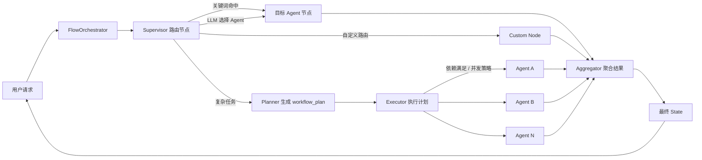
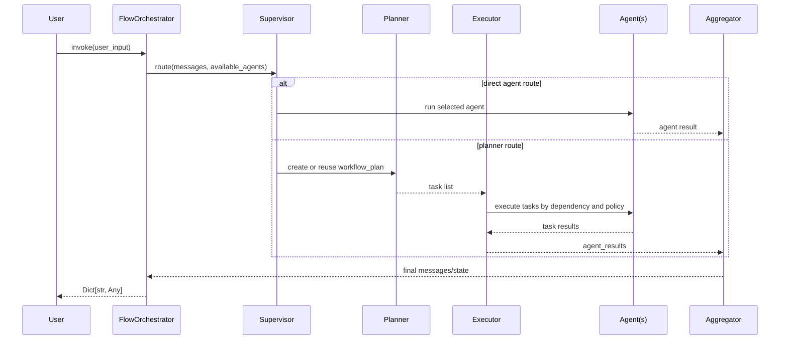

<div align="center">


# LangDeep

**注解驱动、面向企业场景设计的多 Agent 工作流框架**

[](https://www.python.org/downloads/)
[](./LICENSE)
[](https://github.com/langchain-ai/langchain)
[](https://github.com/langchain-ai/langgraph)

**语言：** [English](README.md) | 简体中文

**项目状态：Beta - v2.0.12**

核心 API 已进入第二个大版本，适合企业内部受控试点。关键生产环境仍应先完成模型供应商、密钥、审计、沙箱、持久化和运维策略评审。

</div>

---

## ✨ 为什么选择 LangDeep？

LangDeep 基于 **LangChain** 和 **LangGraph** 构建，提供一套以注册表和装饰器为核心的多 Agent 工作流框架。你可以用 `@model`、`@register_tool`、`@agent` 等声明式 API 注册组件，再由 `FlowOrchestrator` 统一完成 Supervisor 路由、Planner 规划、Executor 执行和 Aggregator 聚合。

v2.0.0 的重点是稳健性：新增运行时诊断、增强健康检查、公开模型配置快照接口，并完善测试与覆盖率门槛，便于在企业系统中做启动前校验和持续集成。

- **🎨 注解驱动**：使用 `@model`、`@provider`、`@register_tool`、`@agent`、`@memory`、`@cache`、`@im_channel`、`@sandbox` 注册组件。
- **🧠 Supervisor 路由**：先走关键词快速路由，再走 LLM tool-call 路由，降低简单请求的调度成本。
- **📋 任务规划与执行**：支持 LLM 动态规划、显式 `workflow_plan`、依赖排序、并发执行和重试。
- **🔌 模型 Provider 扩展**：内置 OpenAI、Anthropic、Azure OpenAI、Ollama、Vertex AI、Google GenAI、DeepSeek、mock provider，也支持自定义 provider。
- **🧩 企业扩展点**：可替换 `RoutingStrategy`、`PlanGenerator`、`TaskRunner`、`ResultMerger`。
- **🗄️ 存储与缓存抽象**：支持 `@memory`、`@cache` 注册可插拔后端；LLM 响应缓存默认关闭，可显式启用。
- **💬 IM 接入层**：提供 `@im_channel`、`WebhookReceiver`、`IMMessage`、`PlatformType` 等适配层能力。
- **🔒 沙箱执行**：内置 `SubprocessSandbox` 和 `@sandbox`；它适合可信或半可信本地任务，不应作为不可信代码的完整安全边界。
- **🔐 密钥管理**：提供 `SecretsManager`、`EnvSecretsProvider`，避免在业务代码中硬编码密钥。
- **🔄 流程生命周期**：提供 `ProcessManager`、`ProcessState` 等长流程管理基础设施。
- **📊 可观测性**：`HealthChecker`、`MetricsCollector`、`FlowOrchestrator.health()` 提供运行状态与基础指标。
- **✅ 启动前诊断**：`validate_runtime()` 检查模型、Provider、Agent、Tool 引用和可选 Agent 实例化，提前发现配置漂移。

---

## 📦 安装

### PyPI 安装

```bash
pip install langdeep
```

### 源码安装

```bash
git clone https://github.com/ZChunzi/LangDeep.git
cd LangDeep
pip install -e .
```

### 可选依赖

```bash
# 安装可选模型 Provider 依赖
pip install -e ".[all]"

# 也可以按 Provider 单独安装：
# .[anthropic], .[google-genai], .[vertexai], .[ollama]

# 安装测试、覆盖率、Lint、构建工具
pip install -e ".[dev]"
```

---

## 🚀 快速开始：无外部 API Key 示例

下面示例使用内置 `mock` provider，可以直接在本地运行。注意：`@register_tool` 或 `@regist_tool` 包装的函数必须有 docstring，因为 LangChain 在创建 Tool 时会校验描述。

```python
from langdeep import (
    AssistantMessage,
    FlowOrchestrator,
    UserMessage,
    agent,
    last_assistant_text,
    model,
    register_tool,
    validate_runtime,
)


@model(name="mock_chat", provider="mock", model_name="mock-chat")
def mock_chat():
    pass


@register_tool(name="get_weather", description="返回模拟天气。")
def get_weather(city: str) -> str:
    """返回模拟天气。"""
    return f"{city}: sunny, 25C"


@agent(
    name="weather_agent",
    description="回答简单天气问题。",
    routing_keywords=["weather", "天气"],
    model="mock_chat",
    tools=["get_weather"],
)
def weather_agent():
    class WeatherAgent:
        def invoke(self, state):
            question = ""
            for message in reversed(state.get("messages", [])):
                if isinstance(message, UserMessage):
                    question = str(message.content)
                    break
            answer = f"Question: {question}\n{get_weather('Beijing')}"
            return {"messages": [AssistantMessage(content=answer)]}

        async def ainvoke(self, state):
            return self.invoke(state)

    return WeatherAgent()


# 企业服务启动前建议先做诊断
validate_runtime(instantiate_agents=True).raise_for_errors()

orchestrator = FlowOrchestrator(
    supervisor_model="mock_chat",
    enable_checkpoint=False,
)

result = orchestrator.invoke("北京天气怎么样？")
print(last_assistant_text(result))
```

运行后应看到类似输出：

```text
Question: 北京天气怎么样？
Beijing: sunny, 25C
```

---

## 🧠 核心概念

### 注册表与装饰器

LangDeep 运行时围绕一组进程内 singleton 注册表工作。装饰器在模块 import 时写入注册表，`FlowOrchestrator` 初始化时读取当前注册表并构建 LangGraph。

| 装饰器 / API | 注册内容 | 主要用途 |
|---|---|---|
| `@model` | `ModelConfig` | 注册模型配置，模型实例懒加载 |
| `@provider` / `register_provider` | Provider 工厂 | 接入或覆盖模型提供商 |
| `@register_tool` | LangChain Tool | 注册可供 Agent 使用的工具 |
| `@agent` | Agent 工厂和元数据 | 注册可路由、可执行的 Agent |
| `@memory` | Memory 后端工厂 | 注册会话记忆后端 |
| `@cache` | Cache 后端工厂 | 注册缓存后端 |
| `@im_channel` | IM 处理器 | 注册消息平台处理器 |
| `@sandbox` | Sandbox 后端 | 注册代码执行后端 |

### FlowOrchestrator

`FlowOrchestrator` 是主入口。当前版本公开的方法包括：

- `invoke(user_input, context=None, workflow_plan=None, template_name=None)`
- `ainvoke(user_input, context=None, workflow_plan=None, template_name=None)`
- `astream(user_input, context=None, **kwargs)`
- `chat(user_input, session_id=None, context=None, ...)`
- `chat_text(user_input, session_id=None, context=None, ...)`
- `invoke_messages(messages, context=None, ...)`
- `invoke_state(state, context=None)`
- `health()`
- `get_metrics()`
- `graph`

`invoke()` 支持字符串、单条 LangChain message、LangChain message 列表，
也支持 `{"messages": [user_message("hi")]}` 这类 LangGraph 风格
state dict。多轮对话推荐使用 `chat(..., session_id=...)`，并配合已注册的
memory backend 自动管理历史。

没有公开 `run()` 方法，请使用 `invoke()` 或 `chat()`。

### Agent 运行契约

`@agent` 注册的工厂应返回一个可运行对象，至少提供：

```python
def invoke(self, state): ...
```

为了兼容异步执行，建议同时提供：

```python
async def ainvoke(self, state): ...
```

如果设置 `auto_build=True` 且工厂返回 `None`，LangDeep 会尝试通过已注册的 Agent Builder 自动构建 Agent。

---

## 🏗️ 架构图

### 运行链路



### 注册表与基础设施

```mermaid
flowchart TB
    subgraph App["应用代码"]
        Models["@model"]
        Providers["@provider / register_provider"]
        Tools["@register_tool"]
        Agents["@agent"]
        Memory["@memory"]
        Cache["@cache"]
        IM["@im_channel"]
        Sandbox["@sandbox"]
    end

    subgraph Registries["LangDeep 注册表"]
        ModelRegistry["model_registry"]
        ProviderRegistry["provider_registry"]
        ToolRegistry["tool_registry"]
        AgentRegistry["agent_registry"]
        MemoryRegistry["memory_registry"]
        CacheRegistry["cache_registry"]
        IMRegistry["im_channel_registry"]
        SandboxRegistry["sandbox_registry"]
    end

    subgraph Runtime["运行时核心"]
        Orchestrator["FlowOrchestrator"]
        PromptLoader["MarkdownPromptLoader"]
        ExecutionPolicy["ExecutionPolicy"]
        Diagnostics["validate_runtime"]
        Health["HealthChecker"]
        Metrics["MetricsCollector"]
        Secrets["SecretsManager"]
        Process["ProcessManager"]
    end

    Models --> ModelRegistry
    Providers --> ProviderRegistry
    Tools --> ToolRegistry
    Agents --> AgentRegistry
    Memory --> MemoryRegistry
    Cache --> CacheRegistry
    IM --> IMRegistry
    Sandbox --> SandboxRegistry

    ModelRegistry --> Orchestrator
    ProviderRegistry --> Orchestrator
    ToolRegistry --> Orchestrator
    AgentRegistry --> Orchestrator
    PromptLoader --> Orchestrator
    ExecutionPolicy --> Orchestrator

    ModelRegistry --> Diagnostics
    ToolRegistry --> Diagnostics
    AgentRegistry --> Diagnostics

    ModelRegistry --> Health
    MemoryRegistry --> Health
    CacheRegistry --> Health
    ToolRegistry --> Health
    AgentRegistry --> Health

    Secrets -.-> Orchestrator
    Process -.-> Orchestrator
    Metrics -.-> Orchestrator
```



### 规划执行时序



---

## 🔌 模型与 Provider

### 使用内置 Provider

```python
import os
from langdeep import model


@model(
    name="gpt4o",
    provider="openai",
    model_name="gpt-4o",
    api_key=os.getenv("OPENAI_API_KEY"),
    temperature=0.2,
)
def gpt4o():
    pass
```

内置 Provider 名称：

- `openai`
- `anthropic`
- `azure_openai`
- `ollama`
- `vertexai`
- `google_genai`
- `deepseek`
- `mock`

### DeepSeek v4 thinking mode

内置 `deepseek` provider 会使用 `DeepSeekChatModel`。这是一个面向
LangChain `ChatOpenAI` 的适配器：DeepSeek v4 工具调用会保留
`reasoning_content`，`deepseek-reasoner` 历史消息会自动移除
`reasoning_content`。

```python
import os
from langdeep import configure_deepseek_v4, model


@model(
    name="deepseek_v4",
    provider="deepseek",
    model_name="deepseek-v4-pro",
    api_key=os.getenv("DEEPSEEK_API_KEY"),
    extra_params=configure_deepseek_v4(
        thinking="enabled",
        reasoning_effort="high",
    ),
)
def deepseek_v4():
    pass
```

`@model` 支持通过 `extra_params={...}` 或直接关键字参数传递 provider
专属配置。对 DeepSeek，LangDeep 也兼容顶层 `thinking={...}`，并会自动
转换为 DeepSeek 要求的 `extra_body={"thinking": ...}` 请求结构。

高级 provider 可以复用 `build_deepseek_payload_messages()`，或将
`reasoning_content_policy` 显式设置为 `auto`、`preserve`、`tool_calls`
或 `drop`。

### 注册自定义 Provider

Provider 工厂接收 `ModelConfig`，返回 LangChain `BaseChatModel`。

```python
from langchain_core.language_models import BaseChatModel
from langdeep import ModelConfig, provider, register_provider


@provider(name="custom_provider")
def create_custom_provider(config: ModelConfig) -> BaseChatModel:
    ...


def create_other_provider(config: ModelConfig) -> BaseChatModel:
    ...


register_provider("other_provider", create_other_provider)
```

> 注意：`register_provider()` 的当前签名是 `register_provider(name, factory)`，不是配置式函数；Provider 的 `base_url`、`api_key` 等参数应通过 `@model(..., base_url=..., api_key=...)` 或 `ModelConfig` 传入。

---

## 🧩 Agent、Tool 与自动构建

### 注册工具

```python
from langdeep import register_tool


@register_tool(
    name="search_docs",
    description="搜索内部文档。",
    category="knowledge",
    tags=["internal", "docs"],
)
def search_docs(query: str) -> str:
    """搜索内部文档。"""
    return f"results for {query}"
```

`regist_tool` 仍作为向后兼容别名保留。

### 注册 Agent

```python
from langdeep import AssistantMessage, agent


@agent(
    name="support_agent",
    description="处理客服和支持问题。",
    capabilities=["support"],
    routing_keywords=["support", "help", "支持"],
    model="gpt4o",
    tools=["search_docs"],
)
def support_agent():
    class SupportAgent:
        def invoke(self, state):
            return {"messages": [AssistantMessage(content="Support response")]}

        async def ainvoke(self, state):
            return self.invoke(state)

    return SupportAgent()
```

### ReAct 自动构建

```python
@agent(
    name="react_support",
    description="自动构建的 ReAct 支持 Agent。",
    model="gpt4o",
    tools=["search_docs"],
    auto_build=True,
    agent_type="react",
)
def react_support():
    pass
```

---

## 📋 工作流计划与执行策略

### 显式 workflow_plan

```python
plan = [
    {"id": "collect", "agent": "research_agent", "depends_on": [], "status": "pending"},
    {"id": "write", "agent": "writer_agent", "depends_on": ["collect"], "status": "pending"},
]

result = orchestrator.invoke("生成市场简报", workflow_plan=plan)
```

### 计划校验

```python
from langdeep import validate_workflow_plan


validate_workflow_plan(
    plan,
    available_agents=["research_agent", "writer_agent"],
    available_tools=[],
)
```

### 执行策略

```python
from langdeep import ExecutionPolicy


policy = ExecutionPolicy(
    strategy="priority_queue",
    max_concurrency=3,
    max_retries=3,
    retry_backoff="exponential",
    timeout_seconds=30,
    fail_fast=False,
)
```

支持策略：

- `gather`：并发执行已就绪任务，受 `max_concurrency` 限制。
- `sequential`：按依赖顺序串行执行。
- `priority_queue`：优先执行高优先级任务。

---

## ✅ 企业化诊断与健康检查

### 启动前诊断

```python
from langdeep import validate_runtime


diagnostics = validate_runtime(instantiate_agents=True)
diagnostics.raise_for_errors()
```

`validate_runtime()` 会检查：

- 模型注册名、模型名、Provider 是否有效。
- `temperature`、`max_tokens` 是否合理。
- Agent 元数据名称是否匹配注册表 key。
- Agent 引用的模型和工具是否已注册。
- `instantiate_agents=True` 时 Agent 是否能成功实例化。
- Tool 元数据是否一致，描述是否缺失。

返回值可序列化：

```python
{
    "ok": True,
    "error_count": 0,
    "warning_count": 0,
    "issues": [],
}
```

### 健康检查与指标

```python
health = orchestrator.health()
metrics = orchestrator.get_metrics()
```

`HealthChecker` 会探测模型、memory、cache 后端，并报告 Agent/Tool 注册表一致性。`MetricsCollector` 提供 counter、gauge、histogram 和快照读取。

---

## 🗄️ Memory、Cache、Prompt

### Memory

```python
from langdeep import memory


@memory(name="session_memory", description="进程内会话记忆")
def session_memory():
    pass
```

如果 factory 返回 `None`，内置 `InMemoryBackend` 会被使用。

### Cache

```python
from langdeep import cache


@cache(name="llm_cache", ttl=300, max_entries=1024)
def llm_cache():
    pass
```

如果 factory 返回 `None`，内置 `MemoryCache` 会被使用。LLM 响应缓存默认关闭，需要显式启用：

```python
from langdeep.core.registry.model_registry import model_registry


model_registry.enable_response_cache(ttl=300, max_entries=1024)
```

### Prompt

`MarkdownPromptLoader` 支持内置 Prompt 和外部 `prompt_dir` 覆盖。Prompt 会被缓存，可通过 loader 的 `reload()` 清理缓存。

```python
orchestrator = FlowOrchestrator(
    supervisor_model="gpt4o",
    prompt_dir="./prompts",
)
```

---

## 🔒 安全与生产边界

LangDeep 提供企业化基础设施，但不会替你完成全部生产治理。

- `SubprocessSandbox` 不是不可信代码的完整安全边界；生产环境应使用容器、权限、网络和资源隔离。
- API Key 应通过 `SecretsManager`、环境变量或平台密钥系统注入，不应写死在源码中。
- 接入 IM 平台时，应在业务侧确认签名验证、重试策略、权限边界和审计要求。
- 接收外部传入 `workflow_plan` 时，应先运行 `validate_workflow_plan()`。
- 服务启动时建议运行 `validate_runtime(instantiate_agents=True).raise_for_errors()`。
- 对关键路径建议记录用户请求、路由目标、工作流计划、工具使用、失败原因和 trace id。

---

## 🧪 测试与质量门槛

```bash
# 静态检查
python -m ruff check src tests

# 标准 pytest + 覆盖率
python -m pytest --cov --cov-report=term-missing --cov-report=xml

# 项目自定义测试运行器
python tests/run_all.py

# 编译检查
python -m compileall -q src tests

# 构建包
python -m build --no-isolation
```

当前覆盖率门槛在 `pyproject.toml` 中配置为 `90%`。

---

## 📚 更多文档

完整开发者指南见：

- [docs/developer-guide.md](docs/developer-guide.md)

---

## 📌 v2.0.1 版本说明

v2.0.1 是维护版本，重点新增工具策略基础设施和打包改进。

- 新增 `PolicyAwareTool`、`ToolAuditLog`、`ToolExecutionPolicy`、`ToolExecutionRecord`，提供细粒度的工具治理能力。
- 新增打包测试 (`test_packaging.py`)，验证构建和导入完整性。
- 更新文档，补充工具策略使用指南和打包验证步骤。
- 项目状态更新为 Beta - v2.0.1。

---

## 📌 v2.0.0 版本说明

v2.0.0 重点改进：

- 新增 `validate_runtime()`、`RuntimeValidator`、`RuntimeDiagnostics`。
- `HealthChecker` 增加 memory/cache 后端探测和 Agent/Tool 注册表一致性报告。
- `ModelRegistry` 增加 `get_config()`、`list_model_configs()` 公开快照接口。
- 包版本升级到 `2.0.0`，项目状态调整为 Beta。
- 补充诊断测试，保持标准测试和自定义测试运行器全量通过。

---

## 📄 License

LangDeep 使用 MIT License。
